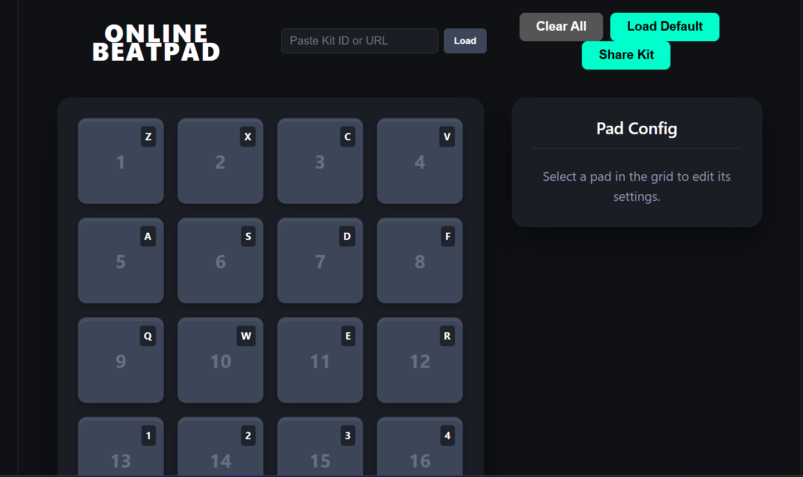

# 🥁 Online Cloud Beatpad

A full-stack MERN application that allows users to play a low-latency web-based drum machine, upload custom audio samples, and share their unique sound kits with the world via a custom URL.

 <!-- Replace with an actual screenshot if you have one! -->

## ✨ Features

- **Zero-Latency Audio**: Built with `howler.js` for instant, clipping-free audio playback suitable for rapid finger-drumming.
- **Custom Sound Uploads**: Upload your own `.wav`, `.mp3`, or `.ogg` files to individual pads.
- **Cloud Storage Integration**: Audio files are permanently hosted on **Cloudinary**, solving ephemeral storage issues found in free hosting platforms.
- **Shareable Kits**: Hit "Share Kit" to permanently save your layout to **MongoDB Atlas** and generate a unique URL to send to your friends.
- **Premium Trap Starter Kit**: Comes pre-loaded with a custom-synthesized, 16-pad Trap/808 kit (C-Minor Pentatonic) mapped to the classic MPC keyboard layout (`1234, QWER, ASDF, ZXCV`).

---

## 🛠️ Tech Stack

**Frontend:**
- React.js (Vite)
- Howler.js (Audio Engine)
- CSS Grid & Flexbox (Responsive Dark Mode UI)
- Vercel (Deployment)

**Backend:**
- Node.js & Express.js
- MongoDB Atlas & Mongoose (Database)
- Multer & Multer-Storage-Cloudinary (Multipart File Handling)
- Render (Deployment)

---

## 🚀 Local Setup Instructions

If you want to run this project on your own machine, follow these steps:

### 1. Clone the Repository
```bash
git clone https://github.com/YourUsername/web-beatpad.git
cd web-beatpad
```

### 2. Backend Setup
```bash
cd backend
npm install
```
Create a `.env` file in the `backend` folder and add your cloud credentials:
```env
PORT=5000
MONGODB_URI=your_mongodb_atlas_connection_string
CLOUDINARY_CLOUD_NAME=your_cloudinary_cloud_name
CLOUDINARY_API_KEY=your_cloudinary_api_key
CLOUDINARY_API_SECRET=your_cloudinary_api_secret
```
Start the backend server:
```bash
npm run dev
```

### 3. Frontend Setup
Open a new terminal window:
```bash
cd frontend
npm install
```
Create a `.env` file in the `frontend` folder:
```env
VITE_API_URL=http://localhost:5000
```
Start the React development server:
```bash
npm run dev
```
Navigate to `http://localhost:5173` in your browser!

---

## 🤝 Contributing
Feel free to fork this project, submit pull requests, or open issues to suggest new features (e.g., adding an audio sequencer, MIDI keyboard support, or volume knobs!).

**Happy Beatmaking! 🎧**
